# GR GameStation

Aplicação web desenvolvida em Angular para gerenciamento de uma loja de jogos, com integração ao Firebase para autenticação e armazenamento de dados.

---

## 🚀 Tecnologias utilizadas
- Angular
- TypeScript
- HTML5
- CSS3
- Firebase (Authentication / Firestore / Hosting)

---

## 🔥 Firebase
Este projeto utiliza o Firebase para:
- Autenticação de usuários
- Armazenamento de dados (Firestore)
- (Opcional) Hospedagem da aplicação
  
---
## 📸 Preview

### Home Page Desktop 🖥️
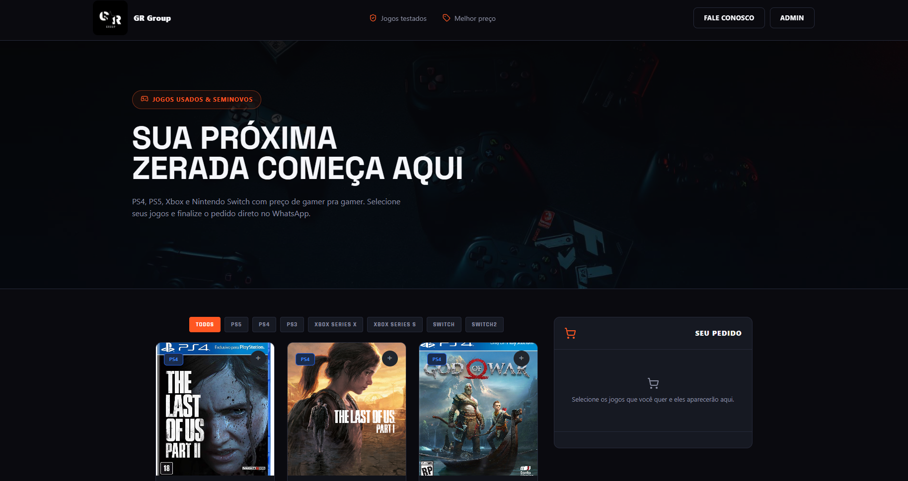
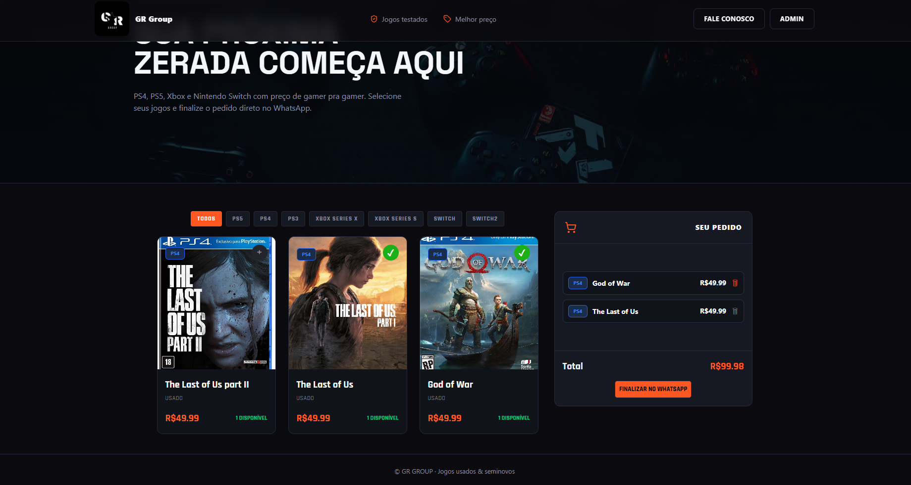

### Home Page Mobile 📱
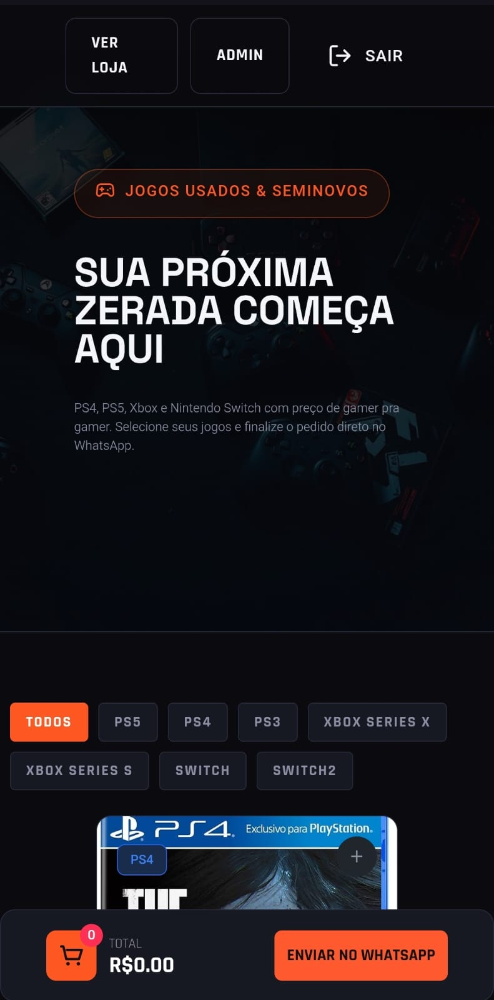 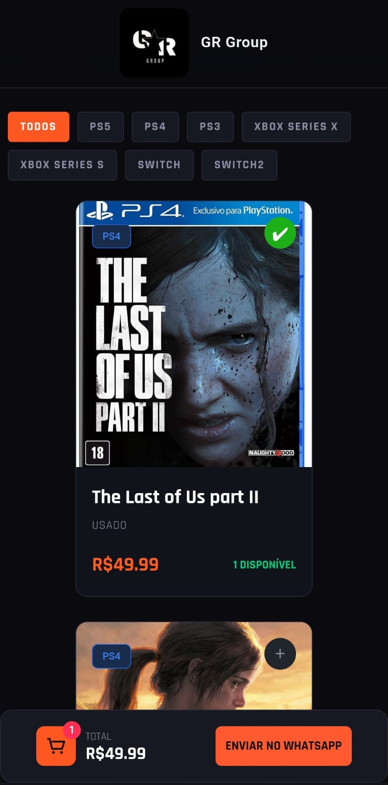 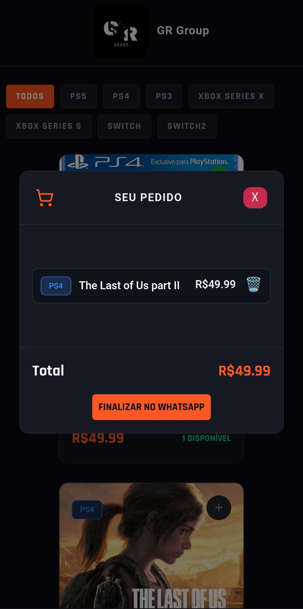

### Login Desktop 🖥️
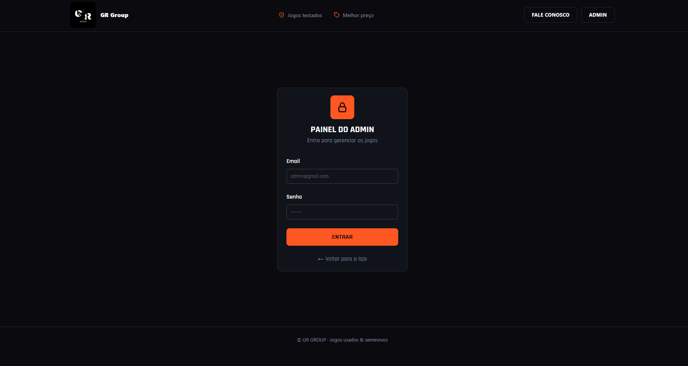 
### Login Mobile 📱
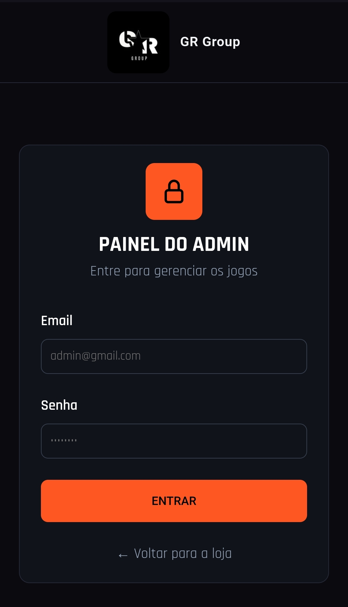

### Admin Desktop 🖥️
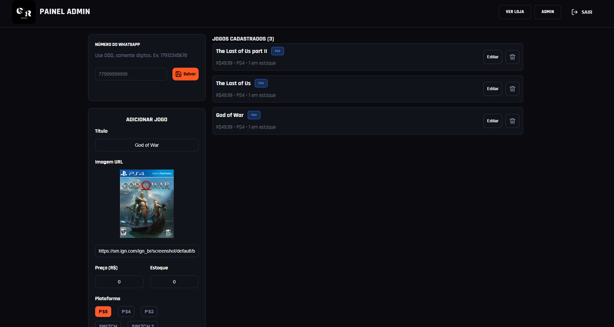 

### Admin  Mobile 📱
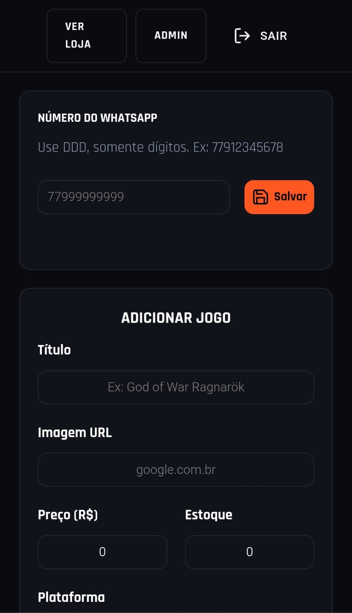 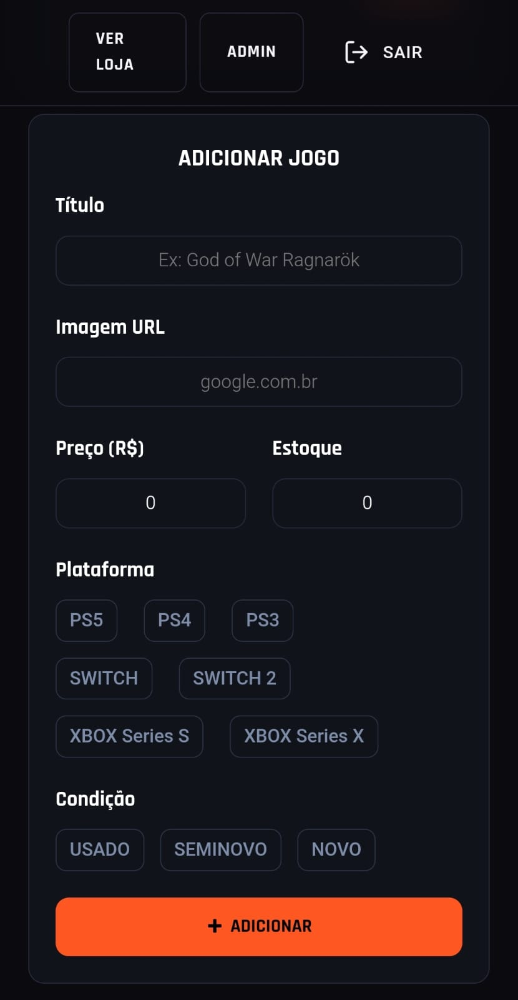 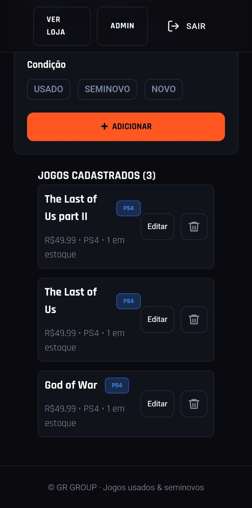


## 📦 Como rodar o projeto

```bash
git clone https://github.com/seu-usuario/seu-repo.git
cd nome-do-projeto
npm install
ng serve
